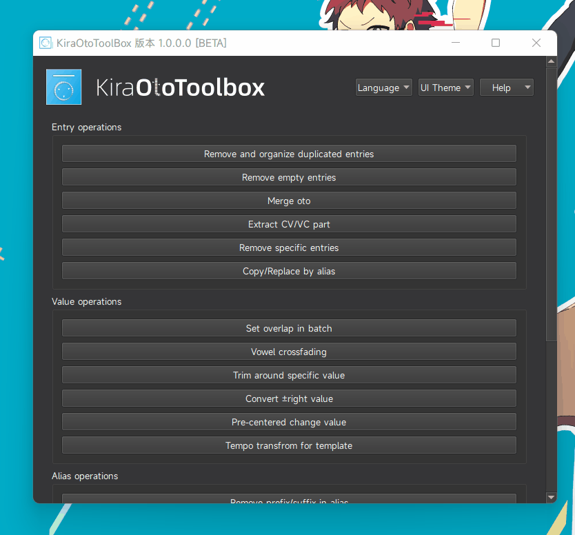
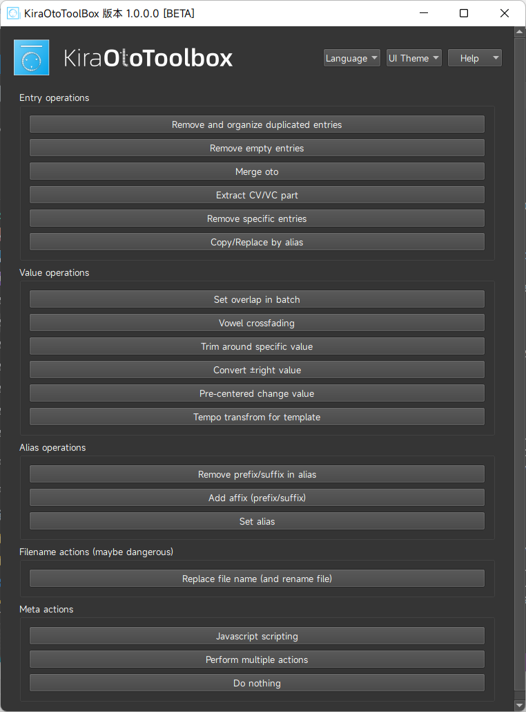
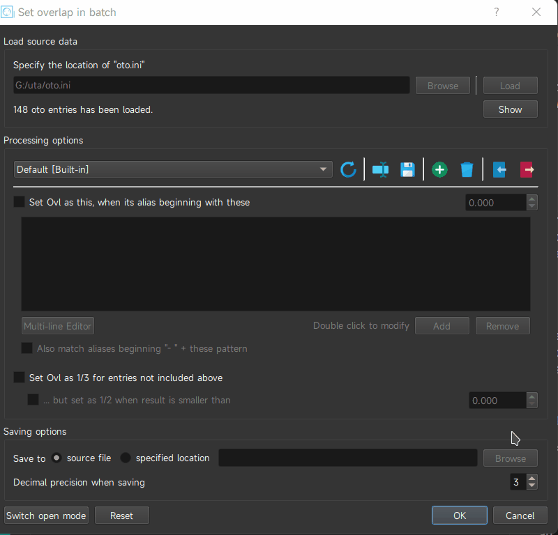
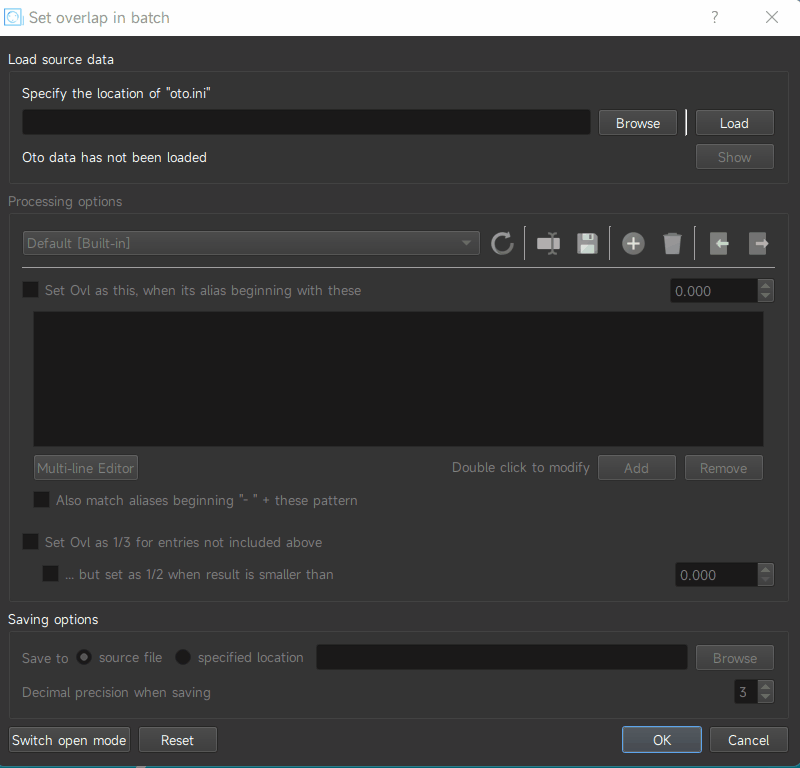
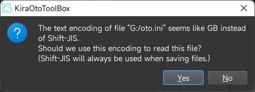
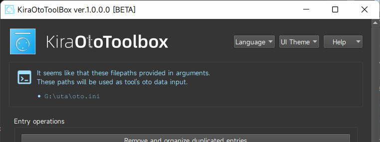
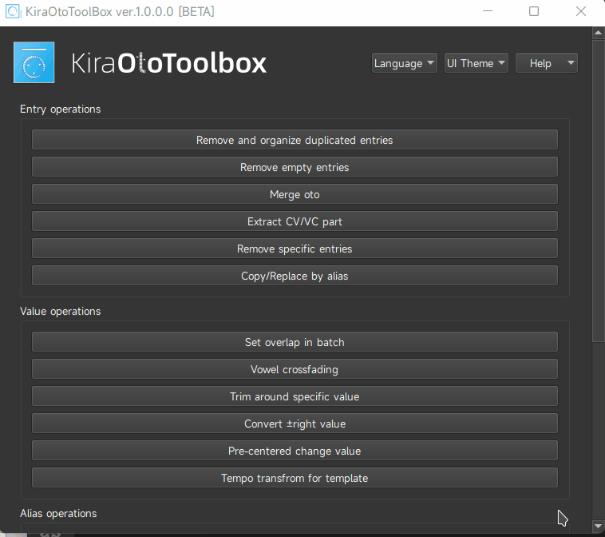
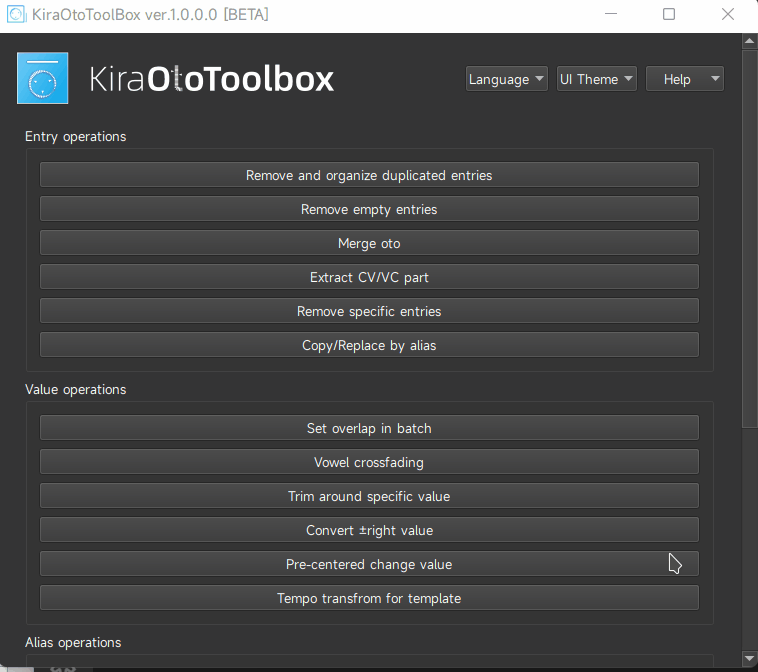
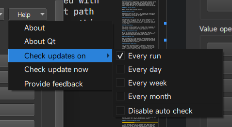

# KiraOtoToolbox

A powerful yet easy-to-use toolbox to manipulate oto.ini, UTAU's voicebank labeling format.

## Basic Workflow

1 Choose the tool you want to use
2 Load oto.ini file to process (you can drag file into path input)
3 Change tool options to meet your need
4 Click "OK" and run it!

## Tools

KiraOtoToolbox comes with a set of tools to fit certain needs in oto's editing.

### Remove and organize duplicated entries

Detect entries with possible duplicated aliases (like a, a, a2, a3, ...), and:

- limit their count
- reassign order number (a.k.a organize, example: a, a, a3, a5 -> a, a2, a3, a4)

### Remove empty entries

Remove entries with no alias and 0 value, often happens to edit a dedicated part of oto.ini, when setParam will create dummy entries for wav files without any.

### Merge oto

Merge two oto.ini and control behavior when a part of their entries have the same alias. You can ask it to replace, skip or keep all. Useful when updating a part of oto.ini in a separate file.

### Extract CV/VC Part

Extract CV/VC part to separate file or reorder them separately in the same file when being asked to. UTAU tends to order oto entries by their filename, which mix them together. But when editing oto.ini, switching CV/VC Part one-by-one constantly while editing is very ...awful. So with this tool, you can make yourself focusing on one side.

### Remove specific entries

Remove entries whose alias meet your rule.

### Copy/Replace by alias

Replace oto's alias or copy it to a new item with the rules you set. You can use this to convert your alias between romaji <-> hiragana, copy needed entries in Syo-CHN, and so on.

### Set overlap in batch

Overlap can be a pain to edit as it can be very mechanical, so why not just hand it to programs? This tool can set overlap in 1/3 (between left and pre-utterance), set to 0/-5(or value you like) for certain alias like plosives, which can be a very universal solution for this value.

### Vowel crossfading

When dealing with CV voicebank, you will need vowel crossfading. You can generate crossfaded vowel entries with this tool, whether you want to copy to a new entry (* V) or just replace it.

### Trim around specific value

We all met entries whose values are like "249.999", "83.333", ... It can be very annoying for some people. With this tool, you can trim them to the value that makes you satisfied, like 250, 83, ...

### Convert ±Right value

UTAU uses negativity of right values to indicate different types of oto entry's right bound. When positive it's calculated from the end of WAV, while negative means it's calculated from the left. You can convert between them with this tool.

### Pre-centered change value

This tool will keep preutterance's <b>absolute</b> position while changing other values relatively. In other words, it calculate new  <b>left</b> value and change it based on the new pattern you input above. If new left value is less than 0, the entry's left and preutterance will be kept as original.

### Tempo transform for template

Sometimes you will find your oto.ini template's tempo (BPM) not matching the BGM you use. It is a nightmare to just use it and dive into the hell of long-distance dragging. Though not very accurate, this tool can save your sanity a lot.

### Remove prefix/suffix in alias

The name is pretty self-explained.

### Add affix (prefix/suffix)

This one too.

### Set alias

A copy for feature with the same name in setParam.

### Replace filename

Replace oto's filename with the rules you set. It will rename the actual files too. For users whose computer is not in the JPN region, it can also modify these names in system-encoding-represented Shift-JIS.

### Perform multiple actions

With the tool "Perform multiple actions", you can construct an action chain to perform on your input. You can save them via preset, and use them later.

### Javascript scripting

You can also write your own code with the tool "Javascript scripting" when our tools were not fit your needs.

## Other useful features

### Preset system

All tools in KiraOtoToolbox can have presets, and a bunch of them comes with some handy built-in ones. You can also export your preset and import others' ones.

### Process a batch of files

You can switch to the batch mode in the tool and process multiple files with the same options. Combined with "Perform multiple actions" tool, it can be very fast and powerful.

By the way, you can drag a batch of file into path input in batch mode.

### Control decimal precision on saving

You can control decimal precision for fields in saving options.

### Encoding detecting

You may have oto.ini that is not saved using Shift-JIS (they should, but some programs don't get it). KiraOtoToolbox will detect them when loading and tell you to read using their actual encoding.

### Drop-on-program/setParam support

...or it should be called as "CLI parameter mode". When opened with paths in CLI parameter, KiraOtoToolbox will use them as input path automatically. You can drag files on KiraOtoToolbox to trigger this.

setParam has support to pass file path to its plugins. The plugin.txt to support setParam is include with release binaries.

### Dark mode

You can switch between light/dark ui mode.

### i18n support

KiraOtoToolbox can be translated into languages. Currently, only English and Simplified Chinese are present.

### Check update

KiraOtoToolbox will check if their is new version automatically.

## Build

You need to build KFR audio library first, since it's a complex cmake project and can not just plug into qmake building trees.

KiraOtoToolbox don't use the DFT part of KFR, so all supported compliers is ok.

Other dependencies are all ``git subtree`` in this repo, and all configured in ``.pro`` file. So you can just compile it in Qt Creator.

It's recommended to using Qt 5.15 since I use it while developing this. But Qt 6 shouldn't change that much to break code compatibility with this project (no guarantee though).

## License

    This program is free software: you can redistribute it and/or modify
    it under the terms of the GNU General Public License as published by
    the Free Software Foundation, either version 3 of the License, or
    (at your option) any later version.
    This program is distributed in the hope that it will be useful,
    but WITHOUT ANY WARRANTY; without even the implied warranty of
    MERCHANTABILITY or FITNESS FOR A PARTICULAR PURPOSE.  See the
    GNU General Public License for more details.
    You should have received a copy of the GNU General Public License
    along with this program. If not, see https://www.gnu.org/licenses/.

    In addition, as a special exception, the copyright holders give
    permission to link the code of portions of this program with the
    OpenSSL library under certain conditions as described in each
    individual source file, and distribute linked combinations
    including the two.
    You must obey the GNU General Public License in all respects
    for all of the code used other than OpenSSL.  If you modify
    file(s) with this exception, you may extend this exception to your
    version of the file(s), but you are not obligated to do so.  If you
    do not wish to do so, delete this exception statement from your
    version.  If you delete this exception statement from all source
    files in the program, then also delete it here.

## 3rd party code and assets used by this project

<li>Qt, The Qt Company Ltd, under LGPL v3.</li>
<li><a href="https://github.com/shine5402/KiraUTAUUtils">KiraUTAUUtils</a>, shine_5402, under LGPL v3</li>
<li><a href="https://github.com/shine5402/KiraCommonUtils">KiraCommmonUtils</a>, shine_5402, mainly under the Apache License, Version 2.0</li>
<li><a href="https://github.com/google/diff-match-patch">Diff-Match-Patch</a>, Copyright 2018 The diff-match-patch Authors, under the Apache License, Version 2.0</li>
<li><a href="https://github.com/Dobiasd/FunctionalPlus">FunctionalPlus</a>, BSL-1.0 License</li>
<li>This product includes software developed by the OpenSSL Project for use in the OpenSSL Toolkit. (<a href='http://www.openssl.org'>http://www.openssl.org/</a>)</li>
<li><a href="https://github.com/google/compact_enc_det">compact_enc_det</a>, Copyright 2016 Google Inc., under the Apache License, Version 2.0</li>
<li><a href="https://github.com/Waqar144/QSourceHighlite">QSourceHighlite</a>, Copyright (c) 2019-2020 Waqar Ahmed, under MIT License</li>
</ul>

Some icons are provided by <a href="https://icons8.com">icons8</a>.  <a href="https://github.com/JetBrains/JetBrainsMono">JetBrains Mono</a> font is included under the Apache License, Version 2.0.

