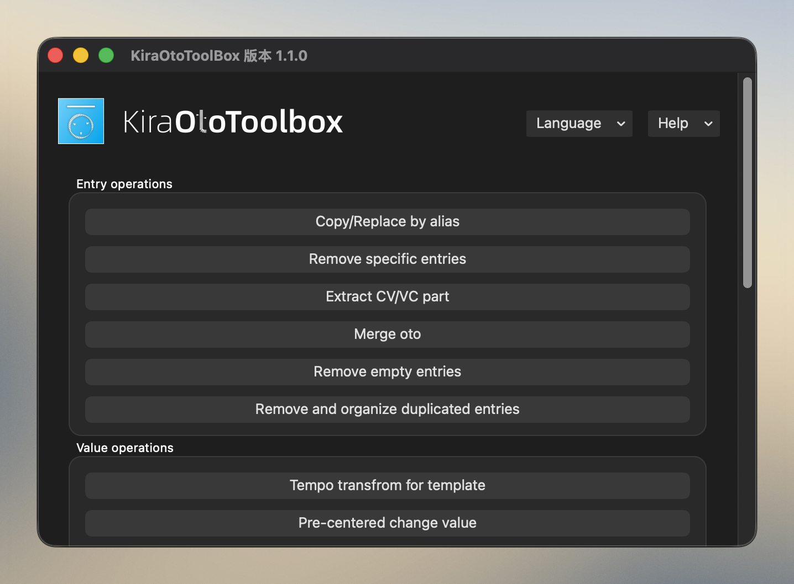

#  KiraOtoToolbox

A collection of practical tools for editing oto.ini, each built to solve a real problem in UTAU voicebank labeling.

## Basic Workflow

1. Choose the tool you want to use
2. Load oto.ini file to process (you can drag file into path input)
3. Change tool options to meet your need
4. Click "OK" and run it!

## Tools

KiraOtoToolbox includes 19 tools across 5 categories:

- **Entry operations** (6 tools) — remove duplicates, remove blanks, merge oto files, split CV/VC parts, remove specific entries, copy/replace by alias
- **Value operations** (6 tools) — batch overlap setting, vowel crossfading, value trimming, right-value conversion, pre-centered value changes, tempo transform
- **Alias operations** (3 tools) — remove affixes, add affixes, set alias with template variables
- **Filename actions** (1 tool) — replace filenames and rename WAV files on disk
- **Meta actions** (3 tools) — chain multiple tools, JavaScript scripting, adjust decimal precision

All tools support presets, batch file processing, and configurable decimal precision on save.

See **[docs/tools.md](docs/tools.md)** for detailed documentation on each tool, including options, behavior, and usage notes.

## Other useful features

### Preset system

Every tool in KiraOtoToolbox supports presets. Many come with handy built-in presets ready to use, and you can export your own or import presets from others.

### Process a batch of files

Switch to batch mode to process multiple files with the same options. Combined with the "Perform multiple actions" tool, this makes repetitive tasks fast and effortless.

You can also drag multiple files directly onto the path input in batch mode.

### Control decimal precision on saving

Choose how many decimal places to use for each field when saving oto.ini files.

### Encoding detection

Some oto.ini files aren't saved in Shift-JIS as they should be — not every program gets it right. KiraOtoToolbox detects the actual encoding when loading and prompts you to read the file using the correct one.

### Drop-on-program / setParam support

Also known as "CLI parameter mode": when launched with file paths as arguments, KiraOtoToolbox automatically uses them as input paths. You can simply drag files onto the application to trigger this.

setParam can also pass file paths to its plugins. A `plugin.txt` configured for setParam is included with release binaries.

## License

This project is licensed under the [GNU General Public License v3](LICENSE).

Third-party code and assets used by this project are listed in the [Acknowledgements](docs/acknowledgements.md) document.
